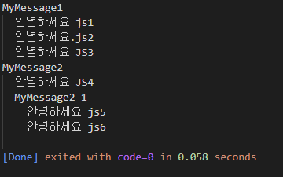

# JS 01-Hello-world

> 2022.11.13

## 파일 작성 (01-HelloWorld.js)
```javascript
'use strict';  //엄격모드 적용-->ES6 호환기능만 사용하도록 명시

console.group('MyMessage1');
    console.log('안녕하세요 js1');
    console.log('안녕하세요.js2');
    console.log('안녕하세요 JS3');
console.groupEnd();

console.group('MyMessage2');
    console.log('안녕하세요 JS4');
    console.group('MyMessage2-1');
        console.log('안녕하세요 js5');
        console.log('안녕하세요 js6');
    console.groupEnd();
console.groupEnd();
```
> 예상 결과: MyMessage1 안에 안녕하세요 js1~안녕하세요 js3이 들어가고 MyMessage2 안에 안녕하세요 JS4와 MyMessage2-1(안녕하세요 js5,6)이 출력될 것이다.


>결과
>


## 파일 작성(HelloWorld.html)
```html
<!DOCTYPE html>
<html lang='ko'>
    <head>
        <meta charset='UTF-8'>
        <meta http-equiv='X-UA-Compatible' content='IE=edge'>
        <meta name='viewport' content='width=device-width, initial-scale=1.0'>
        <title>Document</title>
    </head>
    <body>
        <h1>HelloWorld.html</h1>

        <!-- <script src='HelloWorld.js'></script> -->
        <script src='01-HelloWorld.js'></script>
    </body>
</html>
```
> 예상 결과: 겉 화면에는 아무것도 안 뜨지만 개발자 도구에 들어가서 콘솔 창을 보면 위의 js 결과가 보일 것이다.


> 결과
> 
예상 결과에서 겉 화면에서 나타난 h1 태그를 까먹었다.


## 해당 예제를 하면서 발생한 오류
### Failed to load resource: new::ERR_FILE_NOT_FOUND
> 원인: script를 불러올 때 js 파일 이름을 다르게 적용함


> 해결: js파일 이름을 다시 확인하여 작성함