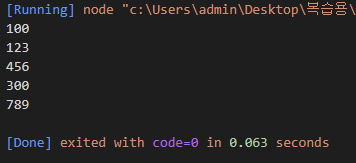
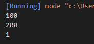
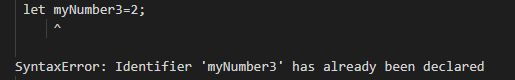

# JS 01-Hello-world

> 2022.11.13

## 파일 작성(01-전역변수.js)
```javascript
'use strict';

//1)변수의 선언과 할당
//선언
var myNumber1;
//할당
myNumber1=100;
console.log(myNumber1);

//2)변수의 선언과 할당 통합
var myNumber2=123;
console.log(myNumber2);

//3)변수값 변경하기
//한 번 만들어진 변수는 다른 값으로 교체 가능
myNumber2=456;
console.log(myNumber2);

//4)변수의 재선언
//일반적으로는 재선언이 안되지만 JS에서는 재선언이 가능하다.
//하지만 이는 권장되지 않는다
//4-1)선언과 할당
var myNumber3=300;
console.log(myNumber3);

//4-2)재선언
var myNumber3=789;
console.log(myNumber3);
```

>예상 결과

1)console.log(myNumber1)=100;

2)console.log(myNumber2)=123;

3)console.log(myNumber2)=456;

4-1)console.log(myNumber3)=300;

4-2)console.log(myNumber3)=789;

>결과




## 파일 작성(02-지역변수.js)
```javascript
'use strict';

//1)선언과 할당
//선언
let myNumber1;
//할당
myNumber1=100;
console.log(myNumber1);

//2)선언과 할당 통합
let myNumber2=200;
console.log(myNumber2);

//3)중복선언 금지
//3-1)선언
let myNumber3=1;
//console.log(muNumber3);
console.log(myNumber3);

//3-2)중복선언
//앞에서 이미 선언된 변수이므로 에러가 발생
//전역변수만 재선언이 가능(안하는 것이 좋음)
let myNumber3=2;
console.log(myNumber3);
```
>예상 결과

1) console.log(myNumber1)=100;
2) console.log(myNumber2)=200;
3-1) console.log(myNumber3)=1;
3-2) console.log(myNumber3)=error;

>결과





## 해당 예제를 하면서 발생한 오류
>원인: myNumber3를 선언하고 muNumber3의 값을 찾으려고 함

>해결: console.log(muNumber3)에서 muNumber3를 myNumber3로 바꿈