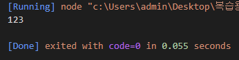
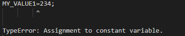

# JS 02-변수와-데이터-타입

>2022.11.14

## 파일 작성(03-상수)
```javascript
'use strict';

const MY_VALUE1=123;
console.log(MY_VALUE1);

MY_VALUE1=234;
//const로 선언된 변수이므로 값을 변경할 수 없다
//읽기 전용
```

>예상 결과
console.log(MY_VALUE1)=123;
234로 정의한 것은 오류가 날 것이다.

>결과

