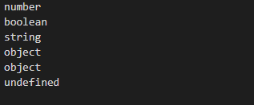
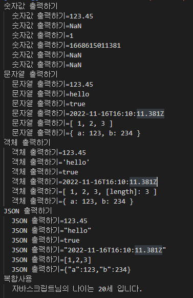
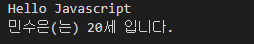

# JS 02-변수와-데이터-타입

>2022.11.16

## 파일 작성(04-데이터타입)
```javascript
'use strict';

//1번
let sampleValue1=123;
console.log(typeof sampleValue1);

//2번
let sampleValue2=true;
console.log(typeof sampleValue2);

//3번
let sampleValue3='hello world';
console.log(typeof sampleValue3);

//4번
let sampleValue4=new Date();
console.log(typeof sampleValue4);

//5번
let sampleValue5=null;
console.log(typeof sampleValue5);

//6번
let sampleValue6;
console.log(typeof sampleValue6);
```

>예상 결과

1번: number

2번: boolen

3번: 문자열

4번: object

5번: null

6번: undefined


>결과



## 파일 작성(05-이스케이프문자)
```javascript
'use strict';

const num=123.45;
const str='hello';
const bool=true;
const obj=new Date();
const arr=[1,2,3];
const json={'a':123,'b':234};

//숫자 표현을 위한 문자: %d
console.group('숫자값 출력하기');
console.log('숫자값 출력하기=%d', num);
console.log('숫자값 출력하기=%d',str);
console.log('숫자값 출력하기=%d',bool);
console.log('숫자값 출력하기=%d',obj);
console.log('숫자값 출력하기=%d',arr);
console.log('숫자값 출력하기=%d',json);
console.groupEnd();

//문자열 표현을 위한 문자: %s
console.group('문자열 출력하기');
console.log('문자열 출력하기=%s',num);
console.log('문자열 출력하기=%s',str);
console.log('문자열 출력하기=%s',bool);
console.log('문자열 출력하기=%s',obj);
console.log('문자열 출력하기=%s',arr);
console.log('문자열 출력하기=%s',json);
console.groupEnd();

//객체 표현을 위한 문자: %o
console.group('객체 출력하기');
console.log('객체 출력하기=%o',num);
console.log('객체 출력하기=%o',str);
console.log('객체 출력하기=%o',bool);
console.log('객체 출력하기=%o',obj);
console.log('객체 출력하기=%o',arr);
console.log('객체 출력하기=%o',json);
console.groupEnd();

//JSON표현을 위한 문자: %j
console.group('JSON 출력하기');
console.log('JSON 출력하기=%j', num);
console.log('JSON 출력하기=%j', str);
console.log('JSON 출력하기=%j', bool);
console.log('JSON 출력하기=%j', obj);
console.log('JSON 출력하기=%j', arr);
console.log('JSON 출력하기=%j', json);
console.groupEnd();

//복합사용
const student='자바스크립트';
const age=20;
console.group('복합사용');
console.log('%s님의 나이는 %d세 입니다.', student, age);
console.groupEnd();
```

>예상 결과

숫자값 출력하기

num=123.45/error/1/11.17(날짜 함수)/1,2,3/a=123,b=234

문자열 출력하기

str=123.45/hello/true/(날짜함수)/1,2,3/a=123,b=234

객체 출력하기

obj=123.45/'hello'/ true/ (날짜함수)/[1,2,3]/a=123, b=234

JSON 출력하기

json=123.45/'hello'/ true/ (날짜함수)/[1,2,3]/{'a':123, 'b':234}

복합사용

console.log('%s님의 나이는 %d세 입니다.', student, age)=자바스크립트님의 나이는 20세입니다.

>결과



1. 숫자값에서 출력되지 않는 str, arr, json은 NaN의 값이 나왔다

2. 문자열에서 출력했던 arr은 [1,2,3],json은 [a:123, b:234]로 출력됐다

3. 객체에서 출력했던 arr은 [length:3]까지 출력됐고, json은 {a:123, b:234}로 출력됐다

>발생한 오류

1. console.log('%s님의 나이는 $d세 입니다'. student, age);에서 student 앞에 ,를 빼먹었다

2. console.log('%s님의 나이는 $d세 입니다.', student, age); 에서 $d가 출력되지 않는다.

>해결방안

1. ''안에 마침표를 집어 넣고 ,를 student 앞에 넣었다
   console.log('%s님의 나이는 $d세 입니다.', student, age);

2. %d로 써야 했으나 $d로 썼기에 생긴 오류이므로 $를 %로 바꾼다.

## 파일 작성(06-변수출력)
```javascript
'use strict';

const a='Hello';
console.log(`${a} Javascript`);

const name='민수';
const age=20;
const message=`${name}은(는) ${age}세 입니다.`;
console.log(message);
```

>예상 결과

console.log(`${a} Javascript`)=Hello Javascript

console.log(message)=민수는 20세 입니다

>결과


