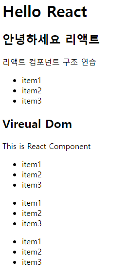
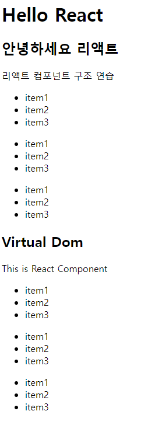

# React 01-hello-react

>2022.11.23

## 파일 작성

작성 순서

Index.js->MySubComponent.js->MyComponent2.js->MyComponent1.js->App.js

Index.js
```javascript
//리액트의 기본을 구성하는 패키지 참조
import React from 'react';

//리액트가 DOM을 구성하기 위한 기능을 참조
import ReactDOM from 'react-dom/client';

//이 소스파일(index.js)과 동일한 위치의 App.js("./App")를 App이라는 이름으로 가져온다
import App from './App';

//컴포넌트를 페이지에 랜더링한다
//App.js에서 정의한 App이라는 이름의 컴포넌트를 HTML태그처럼 사용한다
//->React.StrictMode 적용되어 있는 경우, 선언만 하고 사용되지 않는 변수들에 대한 경고 메시지가 브라우저 콘솔에 표시된다
//개발용이므로 최종 빌드시에는 제거하는 것이 좋다
const root = ReactDOM.createRoot(document.getElementById('root'));
root.render(
  <React.StrictMode>
    <App />
  </React.StrictMode>
);
```

MySubComponent.js
```javascript
import React from 'react';

const MySubComponent=()=>{
    return(
        <div>
            <ul>
                <li>item1</li>
                <li>item2</li>
                <li>item3</li>
            </ul>
        </div>
    );
};

export default MySubComponent;
```

MyComponent2.js
```javascript
import React from 'react';

import MySubComponent from './MySubComponent';

const MyComponent2=()=>{
    return(
        <div>
            <h2>Virtual Dom</h2>
            <p>This is React Component</p>

            <MySubComponent></MySubComponent>
            <MySubComponent></MySubComponent>
            <MySubComponent></MySubComponent>
        </div>
    );
};

export default MyComponent2;
```

MyComponent1.js
```javascript
import React from 'react';

import MySubComponent from './MySubComponent';

//함수형 컴포넌트 정의
//함수 이름은 혼선을 방지하기 위해 소스파일 이름과 동일하게 구성하는 것이 일반적
const Mycomponent1=()=>{
    //리턴은 항상 HTML구조를 의미하는 JSX문법이어야 하고,
    //JSX구조는 무조건 단 하나의 태그요소만 반환해야 함
    //-->복잡한 구조는 부모 요소 하나에 모두 포함되어야 한다는 의미
    return(
        <div>
            <h2>안녕하세요 리액트</h2>
            <p>리액트 컴포넌트 구조 연습</p>
            <MySubComponent></MySubComponent>
            <MySubComponent></MySubComponent>
            <MySubComponent></MySubComponent>
        </div>
    );
};

export default Mycomponent1;
```

App.js
```javascript
//(1)리액트 패키지 참조(모든 js 파일의 최상단에서 필수명시)
import React from 'react';

//(3-1)직접 작성한 컴포넌트 참조
import Hello from './Mycomponent1';
import World from './Mycomponent2';

//(2)App이라는 이름의 함수형 컴포넌트(재사용 가능한 HTML 조각단위)정의
//프로젝트에서 컴포넌트를 렌더링(화면에 출력)하면 함수에서 반환하고 있는 내용이 브라우저에 나타난다.
//반환되는 HTML 코드는 jSX 문법을 사용한다
//JSX-->XML과 비슷한 React 전용 JS 확장 문법

function App() {
  return (
    <div>
      <h1>Hello React</h1>
      {//(3-2)Hello 와 World라는 이름의 컴포넌트 출력
      }
        <Hello></Hello>
        <World/>
    </div>
  );
}

export default App;
```

>예상 결과
```html
<!DOCTYE html>
<html lang='ko'>
    <head>
        <meta charset='UTF-8'>
        <meta http-equiv='X-UA-Compatible' content='IE=edge'>
        <meta name='viewport' content='width=device-width, initial-scale=1.0'>
        <title>01-hello-react</title>
    </head>
<body>
<h1>Hello React</h1>
    <div>
        <h2>안녕하세요 리액트</h2>
        <p>리액트 컴포넌트 구조 연습</p>
        <div>
            <ul>
                <li>item1</li>
                <li>item2</li>
                <li>item3</li>
            </ul>
        </div>
        <div>
            <h2>Vireual Dom</h2>
            <p>This is React Component</p>
            <div>
            <ul>
                <li>item1</li>
                <li>item2</li>
                <li>item3</li>
            </ul>
            </div>
            <div>
                <ul>
                    <li>item1</li>
                    <li>item2</li>
                    <li>item3</li>
                </ul>
            </div>
            <div>
                <ul>
                    <li>item1</li>
                    <li>item2</li>
                    <li>item3</li>
                </ul>
            </div>
        </div>
    </div>
</body>
</html>
```


>실제 결과



>예상 결과와 달랐던 점
MyComponent1.js에서 MySubComponent.js를 3번 참조하였으나 이를 깜박하고 한 번만 참조하여 예상하였음